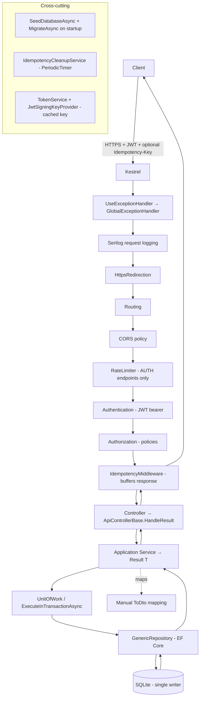

# Backend Anti‑Patterns, Performance, Security & Scalability Audit

> **Scope:** `server/` — `InventoryManagement.API`, `InventoryManagement.Application`, `InventoryManagement.Domain`, `InventoryManagement.Infrastructure`
> **Stack:** .NET 10, EF Core 10, ASP.NET Core, SQLite, JWT auth, Serilog
> **Audit type:** Static code review + architectural / threat / scalability analysis (pen‑test reasoning, DSA review, data‑integrity review)
> **Reviewer stance:** Target requirement = *domain‑agnostic, framework‑agnostic, reusable, multi‑tenant / multi‑client / multi‑user backend that stays responsive under extreme load with maximum security and efficiency.*
> **Date:** 2026‑08‑22

---

## 1. Executive summary

The backend is a **well‑engineered Clean Architecture solution**. It already does many things right: layered separation, the Result pattern, optimistic concurrency, an idempotency subsystem, transactional stock ledgering, Microsoft‑native password hashing, a centralized exception handler, and structured logging. Those strengths are catalogued in [§9](#9-what-is-already-done-well).

However, measured against the stated goal — *a reusable, domain‑agnostic, multi‑tenant backend that scales to millions→trillions of requests/sec with maximum security* — there are **material gaps**. The three most important:

| # | Theme | One‑line problem | Severity |
|---|-------|------------------|----------|
| 1 | **Multi‑tenancy** | There is **no tenant boundary anywhere** — no `TenantId`, no isolation, no row‑level security. All authenticated users share one global dataset. | 🔴 Critical |
| 2 | **Data store** | **SQLite** is a single‑writer, single‑file engine. It cannot scale horizontally or sustain high write concurrency. | 🔴 Critical |
| 3 | **Domain coupling** | Entities/roles are **medical‑inventory specific** (`EquipmentName`, `NursePractitioner`, "medical equipment"), so the system is not domain‑agnostic. | 🟠 High |

Plus a set of correctness/security issues that matter at scale: a **double‑execution race in idempotency reclaim**, **check‑then‑act (TOCTOU) duplicate detection** that silently admitted duplicate barcode/serial rows and returned HTTP 500 for duplicate emails (both now fixed — [F‑12](#f-12--check-then-act-duplicate-detection--silent-duplicate-rows-and-http-500-under-race)), **login user‑enumeration timing side‑channel**, **non‑revocable JWTs**, **per‑instance in‑memory rate limiting**, **unbounded list endpoints**, and **leading‑wildcard `LIKE` search**.

**Severity legend:** 🔴 Critical · 🟠 High · 🟡 Medium · 🔵 Low / hardening · 🟢 Positive

---

## 2. Methodology

- Read every layer's composition root, all 9 services, repositories, the DbContext, entity configurations, middleware, security primitives, controllers, DTOs, and the `.csproj` dependency set.
- Analysed **request→response flow** end‑to‑end (mind map below) to reason about data mixup, request/response crossover, and concurrency.
- Applied **OWASP Top 10** and **pen‑test reasoning** (authn/authz, enumeration, IDOR, injection, secret handling, DoS).
- Applied **DSA/algorithmic** review (query complexity, N+1, unbounded materialization, hot‑row contention).
- Assessed **scale/throughput** posture (statefulness, caching, horizontal scaling, DB engine limits).

### 2.1 End‑to‑end request/response mind map



**Data‑isolation observation from the map:** the only server‑side identity that flows into writes is the caller's `userId` claim (used for audit columns such as `CreatedByUserId` / `PerformedByUserId`). **No tenant/client boundary is ever applied to a query or command.** Authorization is *role*‑based (Admin / Provider / Staff), never *ownership*‑ or *tenant*‑scoped. See [F‑01](#f-01--no-multi-tenancy-tenant-data-isolation-missing).

---

## 3. Requirement‑fit gaps (multi‑tenant / domain‑agnostic / framework‑agnostic)

### F‑01 · No multi‑tenancy — tenant data isolation missing
**Severity:** 🔴 Critical · **Category:** Security / Architecture · **OWASP A01 (Broken Access Control)**

**Evidence:** No entity in [server/InventoryManagement.Domain/Entities](server/InventoryManagement.Domain/Entities) carries a `TenantId`/`OrganizationId`. [BaseEntity](server/InventoryManagement.Domain/Common/BaseEntity.cs) has `Id`, audit, soft‑delete, and a concurrency token — but no tenant discriminator. Repositories (e.g. [InventoryRepository](server/InventoryManagement.Infrastructure/Repositories/InventoryRepository.cs)) and services (e.g. [InventoryService](server/InventoryManagement.Application/Services/InventoryService.cs)) filter only by domain predicates and `!IsDeleted`, never by tenant.

**Impact:** In any multi‑tenant/multi‑client deployment this is a **cross‑tenant data breach**: any authenticated user of tenant A can read/update/delete tenant B's inventory, users, suppliers, locations, and movement ledger (subject only to coarse role). This directly contradicts the "multi‑tenant, multi‑client, multi‑user" requirement and is the single highest‑risk gap.

**Recommendation**
- **Plan A (ambient tenant + global query filter):** add `TenantId` to `BaseEntity`; resolve the tenant from the JWT (a `tenant` claim) via a scoped `ITenantContext`; apply `modelBuilder.Entity<T>().HasQueryFilter(e => e.TenantId == _tenant.Id && !e.IsDeleted)` for every entity; stamp `TenantId` in `AppDbContext.SaveChanges`. Add composite indexes `(TenantId, …)` on all hot lookups. This is the least‑invasive change and preserves existing APIs.
- **Plan B (physical isolation):** database‑per‑tenant or schema‑per‑tenant with a connection‑string resolver keyed by tenant. Stronger isolation and per‑tenant scaling, higher operational cost.
- **Defence in depth:** enforce tenant scoping in a base repository so a forgotten filter cannot leak data; add integration tests that assert tenant A cannot fetch tenant B's row by id (IDOR test).

---

### F‑02 · Domain‑specific model prevents reuse
**Severity:** 🟠 High · **Category:** Architecture / Reusability

**Evidence:** The model is bound to medical inventory: [Inventory.EquipmentName](server/InventoryManagement.Domain/Entities/Inventory.cs), role [UserRole.NursePractitioner](server/InventoryManagement.Domain/Enums), [UserRepository.GetNursePractitionersAsync](server/InventoryManagement.Infrastructure/Repositories/UserRepository.cs), `AuthConstants.Roles.NursePractitioner` in [TokenService](server/InventoryManagement.Infrastructure/Security/TokenService.cs), and prose like "trackable piece of medical equipment". Ironically, [StockMovement](server/InventoryManagement.Domain/Entities/StockMovement.cs) documents itself as "domain‑agnostic — it works for any SKU in any industry," showing the intent exists but is not carried through.

**Impact:** The backend cannot be reused for a non‑medical domain without renaming entities, roles, and endpoints — breaking the "domain‑agnostic & reusable / versatile" requirement.

**Recommendation**
- **Plan A:** rename to neutral vocabulary (`Item`/`Product`/`Sku` instead of `EquipmentName`; generic `Role`/permission model instead of hard‑coded `NursePractitioner`), keeping the DB columns via `[Column("…")]` and DTO aliases so existing API/ABI stays intact.
- **Plan B:** introduce a small **custom‑fields / attributes** mechanism (typed JSON `Attributes` column + validation schema per tenant) so each client models its own domain without schema churn. Combine with a configurable **RBAC/claims** table instead of boolean `IsAdmin`/`IsProvider` flags.

---

### F‑03 · Provider‑specific SQL breaks framework‑agnosticism
**Severity:** 🟡 Medium · **Category:** Portability / Anti‑pattern

**Evidence:** Filtered unique indexes hard‑code **SQL Server bracket syntax** in [InventoryConfiguration](server/InventoryManagement.Infrastructure/Data/Configurations/InventoryConfiguration.cs#L60-L69):
```csharp
.HasFilter("[Barcode] IS NOT NULL AND [IsDeleted] = 0")
```
The current provider is SQLite ([ServiceCollectionExtensions](server/InventoryManagement.Infrastructure/Extensions/ServiceCollectionExtensions.cs#L37)), which tolerates `[…]`, but PostgreSQL/MySQL do not — the literal filter string is not translated.

**Impact:** Swapping providers (a stated "framework‑agnostic" goal, and required to leave SQLite for scale) will produce invalid DDL. Portability is silently broken.

**Recommendation**
- **Plan A:** express filters provider‑neutrally or per‑provider — e.g. resolve the column/quote via `Database.IsSqlServer()/IsNpgsql()` branches, or drop the `IsDeleted` predicate from the index and rely on the global query filter plus a partial index generated by the provider.
- **Plan B:** move unique‑when‑not‑deleted semantics into a computed/persisted column and index that, avoiding raw filter strings entirely.

---

## 4. Scalability & performance

### F‑04 · SQLite cannot scale to the target load
**Severity:** 🔴 Critical · **Category:** Scalability

**Evidence:** [ServiceCollectionExtensions.cs#L37](server/InventoryManagement.Infrastructure/Extensions/ServiceCollectionExtensions.cs#L37) — `options.UseSqlite(connectionString)`; connection `Data Source=inventory.db` in [appsettings.json](server/InventoryManagement.API/appsettings.json). SQLite serialises writes with a database‑level lock and is a single local file.

**Impact:** "Millions–billions–trillions of requests/sec" is impossible on SQLite. Under concurrent writes you get `SQLITE_BUSY`, lock contention, and no horizontal scaling or replication. This caps the entire system regardless of code quality.

**Recommendation**
- **Plan A:** move to a horizontally scalable RDBMS — **PostgreSQL** (or Azure SQL / Cloud SQL) with read replicas, connection pooling (PgBouncer), and partitioning/sharding by `TenantId`. EF Core provider swap is small once [F‑03](#f-03--provider-specific-sql-breaks-framework-agnosticism) is fixed.
- **Plan B (extreme scale):** a distributed SQL engine (CockroachDB / YugabyteDB / Cloud Spanner) for multi‑region write scaling, plus CQRS read models. Keep SQLite only for local dev/tests via the existing provider‑agnostic design.
- Add **caching** (Redis) for hot reads and an outbox for async projections.

---

### F‑05 · Unbounded "get all" endpoints materialize entire tables
**Severity:** 🟠 High · **Category:** Performance / DoS

**Evidence:** Several endpoints return **every row** with no paging:
- [InventoryService.GetAllInventoriesAsync](server/InventoryManagement.Application/Services/InventoryService.cs#L27-L42) → `GET /api/inventory`
- [UserService.GetAllUsersAsync](server/InventoryManagement.Application/Services/UserService.cs#L33-L42) → `GET /api/users`
- [InventoryAssignmentService.GetAllAssignmentsAsync](server/InventoryManagement.Application/Services/InventoryAssignmentService.cs#L33-L45)
- `GetAvailableInventoriesAsync`, `SearchInventoriesAsync`, category/low‑stock/reorder lists in [InventoryRepository](server/InventoryManagement.Infrastructure/Repositories/InventoryRepository.cs) all `ToListAsync` the full match set.

**Impact:** On large tables these queries stream millions of rows into memory, spike GC/allocations, and can OOM the process — a trivial, unauthenticated‑cost‑multiplier DoS for any authenticated user. Paged variants exist (`GetInventoriesPagedAsync`, `GetUsersPagedAsync`) but the unbounded ones remain exposed.

**Recommendation**
- **Plan A:** make pagination mandatory — remove or cap the "get all" endpoints (server‑enforced `MaxPageSize`, already present in [BusinessConstants.Pagination](server/InventoryManagement.Domain/Constants)); return the paged shape everywhere.
- **Plan B:** keyset (seek) pagination `WHERE (CreatedAt,Id) < (@c,@id) ORDER BY … LIMIT n` for O(log n) deep paging instead of `Skip/Take` (offset paging degrades at high offsets — see [F‑14](#f-14--offset-pagination-degrades-at-depth)).

---

### F‑06 · Full‑text search uses leading‑wildcard `LIKE` (index‑defeating)
**Severity:** 🟠 High · **Category:** Performance / DSA

**Evidence:** [InventoryRepository.SearchInventoriesAsync](server/InventoryManagement.Infrastructure/Repositories/InventoryRepository.cs#L84-L100) and [InventoryService.SearchInventoriesAsync](server/InventoryManagement.Application/Services/InventoryService.cs) translate `.Contains(term)` to `LIKE '%term%'` across seven columns.

**Impact:** A leading `%` wildcard cannot use a B‑tree index → **full table scan, O(n)** per search over 7 columns, unbounded result set. At scale this is one of the most expensive endpoints. Also, `%`/`_` in `term` are not escaped, so a `%` search matches everything.

**Recommendation**
- **Plan A:** use the database's full‑text search (PostgreSQL `tsvector`/GIN, SQL Server FTS) or a search service (OpenSearch/Elasticsearch/Meilisearch) for the text search; keep exact filters (category/status/date) as indexed predicates.
- **Plan B:** trigram index (`pg_trgm` GIN) to accelerate substring search; escape LIKE metacharacters; always page the results.

---

### F‑07 · Rate limiting is in‑memory and auth‑only
**Severity:** 🟠 High · **Category:** Scalability / DoS resilience

**Evidence:** [ApiServiceCollectionExtensions.AddRateLimiting](server/InventoryManagement.API/Infrastructure/ApiServiceCollectionExtensions.cs) registers a fixed‑window limiter **only** for the `auth` policy, partitioned by `context.Connection.RemoteIpAddress`. It is applied only to `AuthController` login/refresh. No global limiter guards inventory/stock/user mutations.

**Impact:**
1. **Not distributed** — the limiter state lives in each instance's memory. With N horizontally‑scaled instances the effective limit becomes N× the configured value; an attacker load‑balanced across instances bypasses it.
2. **No global protection** — every non‑auth mutating endpoint (receive/adjust/dispose/transfer/assign) is unthrottled.
3. Combined with [F‑15](#f-15--client-ip-is-unreliable-no-forwarded-headers), the IP partition key is wrong behind a proxy.

**Recommendation**
- **Plan A:** distributed rate limiting backed by Redis (sliding‑window/token‑bucket) keyed by `(tenant, user, route‑class)`; add a global limiter + per‑endpoint concurrency limiter for write‑heavy routes.
- **Plan B:** enforce quotas at the API gateway / ingress (Envoy, YARP, API Management) so limits are shared and edge‑enforced before hitting app instances.

---

### F‑08 · Dashboard issues 8 sequential round‑trips, no caching
**Severity:** 🟡 Medium · **Category:** Performance

**Evidence:** [DashboardService.GetDashboardStatsAsync](server/InventoryManagement.Application/Services/DashboardService.cs#L34-L90) runs 8 separate `CountAsync` queries sequentially on the shared scoped `DbContext` (correctly not parallelised, since `DbContext` is not thread‑safe).

**Impact:** 8 DB round‑trips per dashboard load, recomputed on every hit. Dashboards are high‑traffic and highly cacheable, so this is wasted DB pressure at scale.

**Recommendation**
- **Plan A:** cache the stats per tenant with a short TTL (e.g. 15–60 s) in `IMemoryCache`/Redis; serve stale‑while‑revalidate.
- **Plan B:** compute counts in **one** round‑trip (a single projection with conditional aggregates / `COUNT(*) FILTER (WHERE …)` on PostgreSQL), or maintain incrementally‑updated counters updated by the movement ledger.

---

### F‑09 · Auto‑migrate on startup (multi‑instance deploy hazard)
**Severity:** 🟡 Medium · **Category:** Reliability / Ops anti‑pattern

**Evidence:** [SeedDatabaseAsync](server/InventoryManagement.Infrastructure/Extensions/ServiceCollectionExtensions.cs#L86) calls `context.Database.MigrateAsync()` on startup, invoked from [Program.Main](server/InventoryManagement.API/Program.cs).

**Impact:** With multiple instances rolling out simultaneously, several processes race to apply DDL; the app also needs schema‑altering DB permissions at runtime (least‑privilege violation), and a slow/failed migration blocks readiness for the whole fleet.

**Recommendation**
- **Plan A:** run migrations as a **separate deploy step / init job** (CI/CD stage, `dotnet ef database update`, or a one‑shot migration container) with an advisory lock; app instances start ready‑to‑serve only.
- **Plan B:** keep startup migration but guard it behind a distributed lock + a leader‑election flag, and grant runtime DB user only DML (not DDL) in production.

---

### F‑10 · Idempotency middleware buffers full request & response in memory
**Severity:** 🟡 Medium · **Category:** Performance / DoS

**Evidence:** [IdempotencyMiddleware](server/InventoryManagement.API/Infrastructure/IdempotencyMiddleware.cs): `ComputeRequestHashAsync` calls `EnableBuffering()` and hashes the whole body; `ExecuteAndCaptureAsync` swaps `Response.Body` for a `MemoryStream` and buffers the entire response before deciding whether it is ≤ `MaxCacheableBodyBytes`.

**Impact:** Large requests/responses are fully materialized in memory for every mutating call carrying an `Idempotency‑Key`. Many concurrent large payloads → memory pressure / GC / potential OOM. The size cap is checked *after* buffering, so it doesn't bound memory.

**Recommendation**
- **Plan A:** enforce a hard request‑size limit before buffering; stream‑hash with a bounded cap and bypass capture when `Content‑Length` exceeds the cap; write directly to the original body when not cacheable.
- **Plan B:** cap `EnableBuffering(bufferThreshold)` to spill to disk beyond a threshold, and skip response capture for known‑large content types.

---

## 5. Concurrency, data integrity & correctness

> Directly addressing the requirement: *"check if there is any chance of data loss, data mismatch, data mixup or crossover, request/response mismatch or mixup."*

### F‑11 · Idempotency lock‑reclaim can double‑execute (data mixup / duplicate write)
**Severity:** 🟠 High · **Category:** Concurrency / Data integrity

**Evidence:** [IdempotentRequest](server/InventoryManagement.Domain/Entities/IdempotentRequest.cs) does **not** extend `BaseEntity`, so it has **no concurrency token**. In [EfIdempotencyStore.TryBeginAsync](server/InventoryManagement.Infrastructure/Idempotency/EfIdempotencyStore.cs), when an existing lock is found **expired/abandoned**, the code calls `Reclaim(...)` then `SaveChangesAsync` and returns `Proceed`. Two concurrent retries that both observe the same expired lock will **both** succeed the update (no optimistic lock guards the row) and **both** return `Proceed`.

**Impact:** The guarded operation executes **twice** despite idempotency — e.g. a "receive stock" retried after a lock timeout could be applied twice, corrupting quantities and writing two ledger rows. This is a genuine (narrow‑window) duplicate‑write / data‑mixup path, precisely the failure class the requirement calls out.

**Note:** The *initial* insert race is correctly handled — a concurrent first insert hits the PK and is caught as `DbUpdateException → InProgress`. Only the **reclaim** path is unguarded.

**Recommendation**
- **Plan A:** make reclaim a **conditional atomic update**: `UPDATE … SET Lock=… WHERE Key=@k AND LockExpiresAt < @now` via `ExecuteUpdateAsync`, and treat "0 rows affected" as "lost the race → InProgress". This makes reclaim a compare‑and‑swap.
- **Plan B:** add a concurrency token (or version column) to `IdempotentRequest` and let EF's optimistic check reject the losing reclaim; wrap begin+business+complete in one transaction so the response is captured atomically with the write (removes the "committed but not recorded" window too).

---

### F‑12 · Check‑then‑act duplicate detection → silent duplicate rows and HTTP 500 under race
**Severity:** 🔴 Critical (barcode / serial) · 🟠 High (email) · **Category:** Concurrency / Data integrity / UX

Every duplicate check in the application layer has the *check‑then‑act* (TOCTOU) shape — `IsXExistsAsync(...)` **then** `AddAsync` + `SaveChangesAsync`, with nothing spanning the two steps: [InventoryService.CreateInventoryAsync](server/InventoryManagement.Application/Services/InventoryService.cs#L72-L115) / `UpdateInventoryAsync`, and [UserService.CreateUserAsync](server/InventoryManagement.Application/Services/UserService.cs#L75-L100) / `UpdateUserAsync`. But the race fails **differently** per column, because only `User.Email` was actually backed by a database constraint — so this finding has two sub‑cases with different failure modes, severities and fixes.

#### F‑12a · `Inventory.Barcode` / `Inventory.SerialNumber` — duplicate rows, silently
**Sub‑severity:** 🔴 Critical

**Evidence:** [InventoryConfiguration](server/InventoryManagement.Infrastructure/Data/Configurations/InventoryConfiguration.cs#L55-L68) created the tenant‑scoped barcode/serial indexes **without `.IsUnique()`** — confirmed in [AppDbContextModelSnapshot](server/InventoryManagement.Infrastructure/Migrations/AppDbContextModelSnapshot.cs#L218-L222) (plain `HasIndex("TenantId", "Barcode")`). This was deliberate: a partial/filtered unique index needs provider‑specific raw SQL, so uniqueness "when present" was delegated to the application layer.

**Impact:** with **no** constraint the losing writer never fails. Two concurrent creates carrying the same barcode both pass the pre‑check and **both commit** → two inventory rows sharing the item‑identity key, with no exception, no log and no 409. `GetInventoryByBarcodeAsync` then silently returns whichever row EF sees first, and per‑item stock/assignment reasoning is corrupted. Undetected data corruption is **worse** than the 500 originally documented here, and mapping `DbUpdateException → 409` does nothing for it — a real constraint is required.

**✅ Fixed:** per‑tenant **filtered unique indexes** `UX_Inventories_TenantId_Barcode` / `UX_Inventories_TenantId_SerialNumber` ([AppDbContext.ApplyUniqueWhenPresentIndexes](server/InventoryManagement.Infrastructure/Data/AppDbContext.cs), migration `AddInventoryUniqueWhenPresentIndexes`). The predicate exempts absent values (`IS NULL` / `= ''`) and soft‑deleted rows, so items with no barcode remain legal and a barcode can be reused after deletion; the same barcode in a different tenant is still allowed. The predicate is the only provider‑specific SQL and is produced by `IDatabaseProviderDialect` ([Data/Providers](server/InventoryManagement.Infrastructure/Data/Providers/DatabaseProviderDialects.cs)) for SQLite / SQL Server / PostgreSQL, so the model stays portable ([F‑03](#f-03--provider-specific-sql-breaks-framework-agnosticism)); an unrecognized provider simply gets no index. The unfiltered composite indexes are kept for lookups, because a partial index is not provably applicable to a plain equality query.

#### F‑12b · `User.Email` — correct data, wrong status code
**Sub‑severity:** 🟠 High

**Evidence:** [UserConfiguration](server/InventoryManagement.Infrastructure/Data/Configurations/UserConfiguration.cs#L37) *does* declare a real unique index (`IX_Users_Email`), but [UnitOfWork.SaveChangesAsync](server/InventoryManagement.Infrastructure/Repositories/UnitOfWork.cs) translated only `DbUpdateConcurrencyException`; a unique‑index violation surfaces as a generic `DbUpdateException` and escaped untranslated.

**Impact:** integrity is preserved (the database rejects the duplicate) but the client receives **HTTP 500** instead of a clean **409 Conflict** — noisy error logs, false alerting, and a non‑actionable client contract.

**✅ Fixed:** `UnitOfWork.SaveChangesAsync` now catches `DbUpdateException`, asks the provider dialect whether it is a uniqueness violation (SQLite extended codes 2067/1555, SQL Server 2601/2627, PostgreSQL SQLSTATE 23505) and throws `DuplicateEntityException`, which the [GlobalExceptionHandler](server/InventoryManagement.API/Infrastructure/ErrorHandling/GlobalExceptionHandler.cs) already maps to **409**. Any other `DbUpdateException` (foreign key, NOT NULL, …) is re‑thrown untouched. The application‑layer pre‑checks stay as the fast path, so the common case still returns a field‑specific `Result.Conflict` without touching the constraint.

**Recommendation**
- **Plan A (implemented):** back every "unique when present" rule with a real per‑tenant filtered unique index, and translate the provider's unique‑violation error into a 409 in one place behind a provider abstraction; keep the pre‑check as a friendly fast path.
- **Plan B:** treat the constraint as the single source of truth and drop the pre‑checks entirely — one round‑trip fewer and no TOCTOU window at all, at the cost of a less specific conflict message. (Serializing check+insert inside `ExecuteInTransactionAsync` is *not* an adequate alternative: it needs a `SERIALIZABLE`/`BEGIN IMMEDIATE` scope to block the phantom, does not scale, and still leaves the schema unconstrained.)

**Regression cover:** `DuplicateDetectionTests` (concurrent duplicate email/barcode/serial → 409 and a single row; absent‑value and cross‑tenant exemptions; barcode reuse after soft delete; non‑unique `DbUpdateException` still propagating), `DatabaseProviderDialectTests` (per‑provider error codes and filter SQL) and `GlobalExceptionHandlerTests` (409 vs 500 contract).

**Residual:** `IX_Users_Email` is global (email is the pre‑tenant login key) and does not exclude soft‑deleted rows, so recreating a deleted user's email now yields a 409 rather than a 500 — better, but the reuse case remains blocked; see [F‑18](#f-18--email-not-normalized--case-sensitive-uniqueness--provider-dependent-login).

---

### F‑13 · Optimistic concurrency with no retry → 409 storms on hot rows
**Severity:** 🟡 Medium · **Category:** Concurrency / Throughput

**Evidence:** [AppDbContext.ApplyAuditAndConcurrency](server/InventoryManagement.Infrastructure/Data/AppDbContext.cs) rotates `BaseEntity.ConcurrencyToken` on every write; conflicts become 409 via [UnitOfWork](server/InventoryManagement.Infrastructure/Repositories/UnitOfWork.cs). There is no server‑side retry.

**Impact:** All writes to a single inventory row (e.g. a popular SKU receiving concurrent receive/adjust/assign operations) serialize on the token. Under contention, most concurrent writers get 409 and must retry client‑side. Correct (no lost update / no oversell — good), but **write throughput per row is bounded** and clients bear the retry burden — relevant for the "extreme load" target.

**Recommendation**
- **Plan A:** add a bounded **retry‑on‑conflict** policy (e.g. Polly) around the transactional write for idempotent stock deltas, with jittered backoff.
- **Plan B:** for very hot SKUs, model stock as an **append‑only movement log** and compute balances by aggregation (or atomic `UPDATE … SET AvailableQuantity = AvailableQuantity + @delta WHERE … AND AvailableQuantity + @delta >= 0`), converting read‑modify‑write into a single conditional statement that removes the token round‑trip on the hot path.

---

### F‑14 · Offset pagination degrades at depth
**Severity:** 🔵 Low · **Category:** Performance / DSA

**Evidence:** [GenericRepository.GetPagedAsync](server/InventoryManagement.Infrastructure/Repositories/GenericRepository.cs) uses `Skip((page-1)*size).Take(size)`.

**Impact:** Offset paging is **O(offset)** on the server (the DB scans and discards skipped rows); page 100 000 is slow. Fine for shallow paging, poor for deep paging at scale.

**Recommendation:** offer keyset/seek pagination for large collections (see [F‑05](#f-05--unbounded-get-all-endpoints-materialize-entire-tables) Plan B). Keep offset paging for small admin lists.

---

## 6. Security & pen‑testing

### F‑15 · Client IP is unreliable — no forwarded‑headers handling
**Severity:** 🟠 High · **Category:** Security / Correctness behind proxy

**Evidence:** [Program.ConfigurePipeline](server/InventoryManagement.API/Program.cs) has no `UseForwardedHeaders()`. The rate limiter and any IP‑based logic read `context.Connection.RemoteIpAddress` ([ApiServiceCollectionExtensions](server/InventoryManagement.API/Infrastructure/ApiServiceCollectionExtensions.cs)).

**Impact:** Behind a load balancer/reverse proxy (mandatory at scale), `RemoteIpAddress` is the **proxy's** IP. The auth rate‑limiter then buckets *all* users into one partition (global throttle or bypass), and any client‑IP audit logging is wrong. Security control effectively disabled.

**Recommendation**
- **Plan A:** add `UseForwardedHeaders` (configure `KnownProxies`/`KnownNetworks`, `ForwardedHeaders = XForwardedFor | XForwardedProto`) early in the pipeline; only trust known proxies to prevent spoofing.
- **Plan B:** derive the rate‑limit key from an authenticated principal (`tenant`+`user`) rather than IP wherever a token is present.

---

### F‑16 · Login timing side‑channel enables user enumeration
**Severity:** 🟡 Medium · **Category:** Security · **OWASP A07**

**Evidence:** [AuthService.LoginAsync](server/InventoryManagement.Application/Services/AuthService.cs#L46-L60): when the user is not found it returns immediately; only when the user exists does it run the expensive PBKDF2 `Verify`. The message is uniform ("Invalid email or password") but the **timing is not**.

**Impact:** An attacker measures response latency to distinguish "email exists" (slow, hashing runs) from "email doesn't" (fast). Defeats the intended anti‑enumeration and aids credential‑stuffing target selection.

**Recommendation**
- **Plan A:** when the user is missing, verify against a **dummy hash** so both paths do equal PBKDF2 work before returning the same failure.
- **Plan B:** add small constant‑time normalization / jitter and rely on the existing auth rate limiter; log and alert on enumeration patterns.

---

### F‑17 · JWT access tokens cannot be revoked before expiry
**Severity:** 🟡 Medium · **Category:** Security · **OWASP A01/A07**

**Evidence:** Access tokens are stateless HMAC JWTs valid for `AccessTokenMinutes: 60` ([appsettings.json](server/InventoryManagement.API/appsettings.json), [TokenService](server/InventoryManagement.Infrastructure/Security/TokenService.cs)). Logout/password‑change/soft‑delete only clear the **refresh** token ([AuthService](server/InventoryManagement.Application/Services/AuthService.cs), [UserService.DeleteUserAsync](server/InventoryManagement.Application/Services/UserService.cs)). There is no `SecurityStamp`/denylist check per request.

**Impact:** A disabled, deleted, password‑changed, or de‑privileged user keeps a fully valid access token for **up to 60 minutes**. Role changes also don't take effect until token expiry. For "maximum security" this revocation gap is notable.

**Recommendation**
- **Plan A:** shorten access‑token lifetime (5–15 min) + rely on refresh rotation; add a per‑user `SecurityStamp` claim validated against the DB/cache on sensitive operations.
- **Plan B:** maintain a Redis **revocation list** keyed by `jti`/user with TTL = token lifetime, checked in a lightweight middleware.

---

### F‑18 · Email not normalized — case‑sensitive uniqueness & provider‑dependent login
**Severity:** 🟡 Medium · **Category:** Security / Correctness

**Evidence:** [UserRepository.GetByEmailAsync](server/InventoryManagement.Infrastructure/Repositories/UserRepository.cs#L17-L24) and `IsEmailExistsAsync` compare `x.Email == email` verbatim; the unique index is on raw `Email` ([UserConfiguration](server/InventoryManagement.Infrastructure/Data/Configurations/UserConfiguration.cs)); [User.Email](server/InventoryManagement.Domain/Entities/User.cs) is documented "case‑sensitive as stored; compared verbatim."

**Impact:**
1. `Admin@x.com` and `admin@x.com` can register as **two accounts** (uniqueness bypass; potential impersonation/confusion).
2. `==` maps to SQL `=`, whose case behaviour is **provider‑dependent** (SQLite = case‑sensitive; SQL Server default = case‑insensitive). The same code authenticates differently across providers — a correctness landmine for a "framework‑agnostic" system.

**Recommendation**
- **Plan A:** store a `NormalizedEmail` (uppercase/invariant) and put the unique index + all lookups on it (the ASP.NET Identity convention); normalize on write.
- **Plan B:** enforce a case‑insensitive collation on the email column consistently per provider.

---

### F‑19 · Weak password policy
**Severity:** 🟡 Medium · **Category:** Security · **OWASP A07**

**Evidence:** [CreateUserDto.Password](server/InventoryManagement.Domain/DTOs/UserDto.cs) and `ChangePasswordDto.NewPassword` only enforce `[StringLength(128, MinimumLength = 8)]`. No complexity, no breached‑password check. (Hashing itself is strong — PBKDF2 via [IdentityPasswordHasher](server/InventoryManagement.Infrastructure/Security/IdentityPasswordHasher.cs).)

**Impact:** `"password"` / `"12345678"` are accepted. Weakens account security under credential attacks.

**Recommendation**
- **Plan A:** add complexity + length rules and a breached‑password check (k‑anonymity against HaveIBeenPwned) at the DTO/validator layer.
- **Plan B:** adopt `Microsoft.AspNetCore.Identity` password validators / configurable policy per tenant.

---

### F‑20 · Seed admin password written to logs in plaintext
**Severity:** 🟡 Medium · **Category:** Security · **OWASP A09 (Logging failures)**

**Evidence:** [SeedDatabaseAsync](server/InventoryManagement.Infrastructure/Extensions/ServiceCollectionExtensions.cs#L122-L133) logs the generated admin password at `Warning`. Serilog persists to `logs/…txt` for ~7 days ([appsettings.json](server/InventoryManagement.API/appsettings.json)).

**Impact:** A real credential lands in plaintext log files (and any log aggregation/SIEM), readable by anyone with log access — a secret‑in‑logs anti‑pattern, even if "one‑time."

**Recommendation**
- **Plan A:** don't print the secret. Require `SeedData:AdminPassword` from a secret store, or write a **one‑time reset token** to a protected channel and force rotation on first login.
- **Plan B:** if a generated secret must be surfaced, emit it once to stdout only in `Development` and never to a persisted sink; redact in production.

---

### F‑21 · CORS + credentials misconfiguration risk
**Severity:** 🔵 Low · **Category:** Security / Config

**Evidence:** [appsettings.json](server/InventoryManagement.API/appsettings.json) sets `Cors:AllowCredentials: true` with `AllowedOrigins: []`. [AddCors](server/InventoryManagement.API/Infrastructure/ApiServiceCollectionExtensions.cs) only enables credentials when origins are non‑empty (safe today), and uses `AllowAnyHeader/AllowAnyMethod`.

**Impact:** Currently safe (empty origins ⇒ browser blocks), but the `AllowCredentials:true` default is a footgun: a future operator adding a wildcard/broad origin with credentials enables cross‑site credentialed requests. `AllowAnyHeader/Method` is broader than needed.

**Recommendation:** keep credentialed CORS strictly to an explicit origin allow‑list per environment/tenant; scope allowed methods/headers; add a config‑validation guard that rejects `AllowCredentials=true` with a wildcard origin.

### F‑22 · Zero clock skew may reject valid tokens across nodes
**Severity:** 🔵 Low · **Category:** Reliability

**Evidence:** `Jwt:ClockSkewSeconds: 0` ([appsettings.json](server/InventoryManagement.API/appsettings.json)) → `ClockSkew = TimeSpan.Zero` in [ApiServiceCollectionExtensions](server/InventoryManagement.API/Infrastructure/ApiServiceCollectionExtensions.cs).

**Impact:** With unsynchronized clocks across a fleet, tokens near their boundary can be rejected intermittently. Recommend a small skew (30–60 s) unless NTP is guaranteed tight.

---

## 7. Anti‑patterns (code‑level)

### F‑23 · Sync‑over‑async during JWT options configuration
**Severity:** 🔵 Low · **Category:** Anti‑pattern

**Evidence:** [AddJwtAuthentication](server/InventoryManagement.API/Infrastructure/ApiServiceCollectionExtensions.cs) resolves the signing key with `keyProvider.GetValidationKeyAsync().GetAwaiter().GetResult()`.

**Impact:** Blocking on async can deadlock in some sync contexts and is a known anti‑pattern. Here it runs once at startup and the key is cached ([JwtSigningKeyProvider](server/InventoryManagement.Infrastructure/Security/JwtSigningKeyProvider.cs)), so impact is low — but it should be async.

**Recommendation:** resolve the key asynchronously during startup (e.g. pre‑warm the provider in an `IHostedService`/`ValidateOnStart` async hook) and hand the resolved key to `TokenValidationParameters`.

### F‑24 · `IDateTimeProvider` bypassed with direct `DateTime.UtcNow`
**Severity:** 🔵 Low · **Category:** Anti‑pattern / Testability

**Evidence:** An `IDateTimeProvider` exists and is used by `AppDbContext`/`TokenService`, but services call `DateTime.UtcNow` directly in ~11 places — e.g. [InventoryAssignmentService](server/InventoryManagement.Application/Services/InventoryAssignmentService.cs) (expiry check, return date, renew), [InventoryService](server/InventoryManagement.Application/Services/InventoryService.cs) (soft delete, expiry window), [MaintenanceService](server/InventoryManagement.Application/Services/MaintenanceService.cs), [UserService](server/InventoryManagement.Application/Services/UserService.cs).

**Impact:** Non‑deterministic time makes business rules (expiry, overdue, renewal) hard to unit‑test and inconsistent with the injected clock. Minor but pervasive.

**Recommendation:** inject `IDateTimeProvider` into the services and replace direct `DateTime.UtcNow` usage.

### F‑25 · `virtual` navigations imply lazy loading that is not enabled
**Severity:** 🔵 Low · **Category:** Anti‑pattern / Clarity

**Evidence:** Entities declare `virtual` navigations (e.g. [Inventory](server/InventoryManagement.Domain/Entities/Inventory.cs), [StockMovement](server/InventoryManagement.Domain/Entities/StockMovement.cs)) but no `UseLazyLoadingProxies` is registered (confirmed absent).

**Impact:** The `virtual` keyword signals lazy loading that doesn't exist; a maintainer may assume navigations auto‑populate. Today they are `null` unless explicitly `Include`d — so DTO mappings that read a non‑included navigation silently produce incomplete data (e.g. a movement's supplier name). No crash, but a subtle data‑completeness trap. (Enabling lazy loading would instead introduce N+1 — so keep explicit includes.)

**Recommendation:** drop `virtual` from navigations (documenting the explicit‑include convention), or intentionally enable lazy loading with `AsSplitQuery` where appropriate — but not both.

### F‑26 · Self‑demotion / last‑admin lockout not guarded
**Severity:** 🔵 Low · **Category:** Logic gap

**Evidence:** [UsersController.DeleteUser](server/InventoryManagement.API/Controllers/UsersController.cs) blocks deleting *self*, which incidentally prevents last‑admin deletion. But an admin can **update themselves** and remove `IsAdmin` (self‑demotion) or set `IsActive=false`; `UpdateUser` doesn't restrict an admin from de‑privileging the last admin ([UserService.UpdateUserAsync](server/InventoryManagement.Application/Services/UserService.cs)).

**Impact:** The last administrator can accidentally lock the whole tenant out of admin functions.

**Recommendation:** guard "at least one active admin must remain" in `UpdateUserAsync`/`DeleteUserAsync`; forbid self‑demotion when the caller is the last admin.

### F‑27 · Audit columns (`CreatedBy`/`UpdatedBy`/`DeletedBy`) largely unpopulated
**Severity:** 🔵 Low · **Category:** Completeness

**Evidence:** [AppDbContext.ApplyAuditAndConcurrency](server/InventoryManagement.Infrastructure/Data/AppDbContext.cs) stamps timestamps + token but never the `*By` fields; soft‑delete flows set `DeletedAt` but not `DeletedBy` ([InventoryService](server/InventoryManagement.Application/Services/InventoryService.cs), [UserService](server/InventoryManagement.Application/Services/UserService.cs)). Only the seeder sets `CreatedBy`.

**Impact:** Incomplete audit trail — "who changed/deleted this" is mostly null, weakening forensic/compliance value at scale.

**Recommendation:** capture the current principal via a scoped accessor and stamp `CreatedBy/UpdatedBy/DeletedBy` centrally in `SaveChanges` (ties in with the `ITenantContext` from [F‑01](#f-01--no-multi-tenancy-tenant-data-isolation-missing)).

---

## 8. Data loss / mixup / crossover — explicit assessment

| Question from the requirement | Finding |
|---|---|
| **Request/response mixup or crossover between users?** | **No cross‑request bleed found.** Services, repositories, `UnitOfWork`, and `DbContext` are all **scoped** per request ([Application](server/InventoryManagement.Application/Extensions/ServiceCollectionExtensions.cs) / [Infrastructure](server/InventoryManagement.Infrastructure/Extensions/ServiceCollectionExtensions.cs) DI). No mutable request state is stored in singletons. The idempotency middleware buffers into a per‑request local `MemoryStream`. ✅ |
| **Lost updates / oversell under concurrency?** | **Prevented** by the rotating concurrency token → 409 ([F‑13](#f-13--optimistic-concurrency-with-no-retry--409-storms-on-hot-rows)). Correct, but throughput‑limited and retry‑less. ✅/⚠️ |
| **Duplicate writes / data mixup?** | **Possible** via the idempotency reclaim race ([F‑11](#f-11--idempotency-lock-reclaim-can-double-execute-data-mixup--duplicate-write)) and via non‑atomic idempotency capture. ⚠️ Concurrent creates could also produce **two inventory rows sharing a barcode/serial** — silently, because those indexes were not unique; now blocked by per‑tenant filtered unique indexes ([F‑12](#f-12--check-then-act-duplicate-detection--silent-duplicate-rows-and-http-500-under-race)). ✅ |
| **Data mismatch (wrong status code / partial writes)?** | Transactions wrap multi‑row stock changes (`ExecuteInTransactionAsync`) so partial writes roll back ✅. Duplicate‑key races used to return 500 instead of 409; unique violations are now translated to 409 in one place ([F‑12](#f-12--check-then-act-duplicate-detection--silent-duplicate-rows-and-http-500-under-race)). ✅ |
| **Cross‑tenant data crossover?** | **Yes — by design gap.** No tenant isolation ([F‑01](#f-01--no-multi-tenancy-tenant-data-isolation-missing)); any user sees all tenants' data. 🔴 |
| **Stock invariant `0 ≤ Available ≤ Quantity`?** | Enforced in stock/assignment flows (dispose/adjust/return cap logic). Consistent. ✅ |
| **Data loss on delete?** | Soft delete everywhere (no hard deletes of business rows); ledger is append‑only with `Restrict` on the required FK. ✅ |

**Net:** the primary data‑crossover risk is **tenant** crossover ([F‑01](#f-01--no-multi-tenancy-tenant-data-isolation-missing)); the main duplicate‑write risk is the **idempotency reclaim** path ([F‑11](#f-11--idempotency-lock-reclaim-can-double-execute-data-mixup--duplicate-write)).

---

## 9. What is already done well

- 🟢 **Clean Architecture** with correct dependency direction and thin controllers over the Result pattern ([ApiControllerBase](server/InventoryManagement.API/Infrastructure/ApiControllerBase.cs)).
- 🟢 **Provider‑agnostic optimistic concurrency** via a rotating GUID token — works even on SQLite ([AppDbContext](server/InventoryManagement.Infrastructure/Data/AppDbContext.cs)).
- 🟢 **Transactional stock ledgering** with an append‑only `StockMovement` audit trail and execution‑strategy transactions ([StockService](server/InventoryManagement.Application/Services/StockService.cs), [UnitOfWork](server/InventoryManagement.Infrastructure/Repositories/UnitOfWork.cs)).
- 🟢 **Idempotency subsystem** (lock → complete → replay, collision detection via body hash, background purge) — the *initial* insert race is handled correctly.
- 🟢 **Strong auth primitives:** Microsoft PBKDF2 hashing with transparent rehash‑on‑login, refresh tokens stored only as SHA‑256 hashes, key‑length validation, secret sourced from env/file/secret store ([IdentityPasswordHasher](server/InventoryManagement.Infrastructure/Security/IdentityPasswordHasher.cs), [TokenService](server/InventoryManagement.Infrastructure/Security/TokenService.cs), [JwtSigningKeyProvider](server/InventoryManagement.Infrastructure/Security/JwtSigningKeyProvider.cs)).
- 🟢 **No secret shipped** — no default admin password; `Jwt:Key` empty by default and required from a secret source.
- 🟢 **Centralized exception handling** that never leaks internals; handles client cancellation cleanly ([GlobalExceptionHandler](server/InventoryManagement.API/Infrastructure/ErrorHandling/GlobalExceptionHandler.cs)).
- 🟢 **First‑party‑first dependencies** — BCrypt replaced by Microsoft hashing; no AutoMapper (manual, allocation‑light mapping). Aligns with the "prefer in‑box SDK" rule.
- 🟢 **Tracking‑free reads by default**, SQL‑side filtering/paging/ordering, and thoughtfully placed indexes ([GenericRepository](server/InventoryManagement.Infrastructure/Repositories/GenericRepository.cs)).
- 🟢 **Correct scoping** — no singleton holds request state (no cross‑request data bleed).

---

## 10. Prioritized remediation roadmap

| Priority | Finding | Effort | Why now |
|---|---|---|---|
| **P0** | [F‑01](#f-01--no-multi-tenancy-tenant-data-isolation-missing) Multi‑tenancy isolation | L | Cross‑tenant breach; core to the requirement |
| **P0** | [F‑04](#f-04--sqlite-cannot-scale-to-the-target-load) Replace SQLite | M | Hard scale ceiling |
| **P0** | [F‑11](#f-11--idempotency-lock-reclaim-can-double-execute-data-mixup--duplicate-write) Idempotency reclaim CAS | S | Duplicate‑write correctness |
| **P0** ✅ | [F‑12](#f-12--check-then-act-duplicate-detection--silent-duplicate-rows-and-http-500-under-race) Per‑tenant filtered unique index for barcode/serial + map unique‑violation → 409 | S | Silent duplicate item‑identity rows (P0) and correct status instead of 500 (P1) |
| **P1** | [F‑05](#f-05--unbounded-get-all-endpoints-materialize-entire-tables) Bound list endpoints | S | DoS / memory |
| **P1** | [F‑07](#f-07--rate-limiting-is-in-memory-and-auth-only) Distributed + global rate limiting | M | Abuse resilience at scale |
| **P1** | [F‑15](#f-15--client-ip-is-unreliable-no-forwarded-headers) Forwarded headers | S | Fixes rate‑limit/logging behind proxy |
| **P1** | [F‑17](#f-17--jwt-access-tokens-cannot-be-revoked-before-expiry) Token revocation / short TTL | M | Security |
| **P1** | [F‑06](#f-06--full-text-search-uses-leading-wildcard-like-index-defeating) Real search engine/FTS | M | Search hot path |
| **P2** | [F‑02](#f-02--domain-specific-model-prevents-reuse)/[F‑03](#f-03--provider-specific-sql-breaks-framework-agnosticism) Domain‑agnostic model + portable SQL | M | Reusability / portability |
| **P2** | [F‑16](#f-16--login-timing-side-channel-enables-user-enumeration) Constant‑time login, [F‑18](#f-18--email-not-normalized--case-sensitive-uniqueness--provider-dependent-login) email normalize, [F‑19](#f-19--weak-password-policy) password policy, [F‑20](#f-20--seed-admin-password-written-to-logs-in-plaintext) secret‑in‑logs | S–M | Security hardening |
| **P2** | [F‑08](#f-08--dashboard-issues-8-sequential-round-trips-no-caching) Cache dashboard, [F‑09](#f-09--auto-migrate-on-startup-multi-instance-deploy-hazard) migration step, [F‑10](#f-10--idempotency-middleware-buffers-full-request--response-in-memory) buffering caps, [F‑13](#f-13--optimistic-concurrency-with-no-retry--409-storms-on-hot-rows) retry policy | S–M | Efficiency / reliability |
| **P3** | [F‑14](#f-14--offset-pagination-degrades-at-depth), [F‑21](#f-21--cors--credentials-misconfiguration-risk)–[F‑27](#f-27--audit-columns-createdbyupdatedbydeletedby-largely-unpopulated) hardening & anti‑patterns | S | Polish |

> **Guardrail:** every change must preserve existing API/ABI (public routes, `ApiResponse<T>` shape, status‑code contract). Tenancy, DB, and search changes are additive/behind interfaces; no breaking signature changes are required for the P0/P1 set.

---

## 11. Appendix — finding → location index

| ID | Primary location |
|----|------------------|
| F‑01 | [BaseEntity](server/InventoryManagement.Domain/Common/BaseEntity.cs), all entities/repositories |
| F‑02 | [Inventory](server/InventoryManagement.Domain/Entities/Inventory.cs), [UserRepository](server/InventoryManagement.Infrastructure/Repositories/UserRepository.cs) |
| F‑03 | [InventoryConfiguration](server/InventoryManagement.Infrastructure/Data/Configurations/InventoryConfiguration.cs#L60-L69) |
| F‑04 | [ServiceCollectionExtensions](server/InventoryManagement.Infrastructure/Extensions/ServiceCollectionExtensions.cs#L37) |
| F‑05 | [InventoryService](server/InventoryManagement.Application/Services/InventoryService.cs#L27-L42), [UserService](server/InventoryManagement.Application/Services/UserService.cs#L33-L42) |
| F‑06 | [InventoryRepository](server/InventoryManagement.Infrastructure/Repositories/InventoryRepository.cs#L84-L100) |
| F‑07 | [ApiServiceCollectionExtensions](server/InventoryManagement.API/Infrastructure/ApiServiceCollectionExtensions.cs) |
| F‑08 | [DashboardService](server/InventoryManagement.Application/Services/DashboardService.cs#L34-L90) |
| F‑09 | [ServiceCollectionExtensions](server/InventoryManagement.Infrastructure/Extensions/ServiceCollectionExtensions.cs#L86) |
| F‑10 | [IdempotencyMiddleware](server/InventoryManagement.API/Infrastructure/IdempotencyMiddleware.cs) |
| F‑11 | [EfIdempotencyStore](server/InventoryManagement.Infrastructure/Idempotency/EfIdempotencyStore.cs), [IdempotentRequest](server/InventoryManagement.Domain/Entities/IdempotentRequest.cs) |
| F‑12 | [InventoryService](server/InventoryManagement.Application/Services/InventoryService.cs#L72-L115), [UserService](server/InventoryManagement.Application/Services/UserService.cs#L75-L100), [InventoryConfiguration](server/InventoryManagement.Infrastructure/Data/Configurations/InventoryConfiguration.cs#L55-L68), [AppDbContext](server/InventoryManagement.Infrastructure/Data/AppDbContext.cs), [UnitOfWork](server/InventoryManagement.Infrastructure/Repositories/UnitOfWork.cs), [DatabaseProviderDialects](server/InventoryManagement.Infrastructure/Data/Providers/DatabaseProviderDialects.cs) |
| F‑13 | [AppDbContext](server/InventoryManagement.Infrastructure/Data/AppDbContext.cs), [UnitOfWork](server/InventoryManagement.Infrastructure/Repositories/UnitOfWork.cs) |
| F‑14 | [GenericRepository](server/InventoryManagement.Infrastructure/Repositories/GenericRepository.cs) |
| F‑15 | [Program](server/InventoryManagement.API/Program.cs) |
| F‑16 | [AuthService](server/InventoryManagement.Application/Services/AuthService.cs#L46-L60) |
| F‑17 | [TokenService](server/InventoryManagement.Infrastructure/Security/TokenService.cs), [UserService](server/InventoryManagement.Application/Services/UserService.cs) |
| F‑18 | [UserRepository](server/InventoryManagement.Infrastructure/Repositories/UserRepository.cs#L17-L24), [UserConfiguration](server/InventoryManagement.Infrastructure/Data/Configurations/UserConfiguration.cs) |
| F‑19 | [UserDto/CommonDto](server/InventoryManagement.Domain/DTOs/UserDto.cs) |
| F‑20 | [ServiceCollectionExtensions](server/InventoryManagement.Infrastructure/Extensions/ServiceCollectionExtensions.cs#L122-L133) |
| F‑21 | [ApiServiceCollectionExtensions](server/InventoryManagement.API/Infrastructure/ApiServiceCollectionExtensions.cs), [appsettings.json](server/InventoryManagement.API/appsettings.json) |
| F‑22 | [appsettings.json](server/InventoryManagement.API/appsettings.json) |
| F‑23 | [ApiServiceCollectionExtensions](server/InventoryManagement.API/Infrastructure/ApiServiceCollectionExtensions.cs) |
| F‑24 | Application services (see finding) |
| F‑25 | Entities + [Infrastructure DI](server/InventoryManagement.Infrastructure/Extensions/ServiceCollectionExtensions.cs) |
| F‑26 | [UsersController](server/InventoryManagement.API/Controllers/UsersController.cs), [UserService](server/InventoryManagement.Application/Services/UserService.cs) |
| F‑27 | [AppDbContext](server/InventoryManagement.Infrastructure/Data/AppDbContext.cs) |

---

*This document is an analysis artefact; sub‑sections marked **✅ Fixed** record remediation that has since landed in the codebase. Findings are ordered by requirement‑fit, then scalability, concurrency/data‑integrity, security, and code‑level anti‑patterns.*
