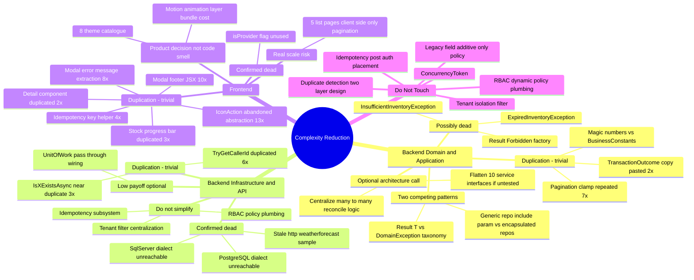
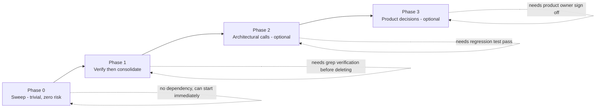

# Complexity Reduction & Simplification Game Plan

**Scope:** `server/` (.NET 10 Clean Architecture API), `client/` (Next.js/React/TypeScript), cross-checked against every doc in `docs/`.
**Method:** four independent full-repo reads (docs corpus; backend Domain+Application; backend Infrastructure+API; frontend) synthesized below. Nothing in this plan was chosen by quota — every item is something an engineer reading the code would flag on its own merits. Several areas were reviewed and found **already proportionate**; they are listed explicitly under [§2 Do Not Touch](#2-do-not-touch--guardrails) so they aren't rediscovered and "simplified" into a regression later.
**Non-negotiable constraint (carried from `Proposed-Enhancement.md` Rules 1–9):** no change here may alter the `ApiResponse<T>` wire contract, existing routes, or DTO shapes; no new third-party dependency is introduced; every phase below has a stated fallback.

---

## 1. Executive Summary

**Verdict: the codebase is not over-engineered at its core. It is a correctly-sized Clean Architecture skeleton for the stated requirements (multi-tenant, dynamic RBAC, provider-agnostic persistence, idempotent mutations, optimistic concurrency), carrying a moderate amount of avoidable procedural duplication on top — not architectural bloat.**

Four things were reviewed in depth and judged **proportionate, not clutter**: tenant isolation (one centralized EF global query filter, zero duplicated `TenantId ==` checks anywhere), dynamic permission/RBAC plumbing (the minimum idiomatic ASP.NET Core shape for DB-defined, per-tenant permissions), the frontend's API client / auth-context / theming architecture (one client, one permission layer, one theme registry — no ad hoc fetches, no competing state libraries), and the idempotency subsystem (heavy, but it is the one place duplicate-write protection for stock/assignment mutations actually lives — cutting it trades away a real guarantee).

What actually drives the "too large" feeling is concentrated in five pockets, none of which require touching tenancy, security, or concurrency guarantees to fix:

| Pocket | Where | Rough size |
|---|---|---|
| Copy-pasted procedural boilerplate | 10 frontend form modals, 5 frontend list pages, 6 backend controllers, 7 backend services | ~500–650 lines |
| Confirmed dead code | 1 unused frontend flag, 2 likely-unused backend exception types, unreachable multi-provider dialect code | ~80–120 lines |
| Two competing patterns doing the same job | backend eager-loading (generic-repo `include` param vs. encapsulated bespoke repos), backend error taxonomy (`Result<T>` vs. `DomainException`) | design decision, not size |
| Abstraction paid for but not yet cashed in | `IDatabaseProviderDialect`'s SqlServer/PostgreSQL branches (only SQLite is wired anywhere), `IUnitOfWork`'s 10-parameter pass-through | ~50 lines + 1 layer |
| Feature scope, not code quality | 8-theme UI catalogue, full motion/animation layer, client-side-only pagination on 5 list pages | product decisions, one real scale risk |

Net effect if every P0/P1 item below is done: **~500–700 fewer lines, 5 fewer duplicate implementations of the same idiom, 2–3 dead files removed, zero change to any tenant-isolation, security, or concurrency behavior.**

---

## 2. Do Not Touch — Guardrails

These were checked and found to be *earning* their complexity. Simplifying any of them would trade away a stated requirement (multi-tenancy, security, scalability, or portability), not just remove clutter. Carried forward from the docs audit and confirmed independently by the code reviews:

1. **The single global EF tenant/soft-delete query filter in `AppDbContext`** (`TenantId == CurrentTenantId && !IsDeleted`, applied once via reflection over every `BaseEntity`). Confirmed: zero repositories add a manual `TenantId ==` check — the centralization is real, not aspirational. Do not move this to per-repository filtering.
2. **`IgnoreQueryFilters()` in the three pre-authentication `UserRepository` lookups** (`GetByEmailAsync`, `IsEmailExistsAsync`, refresh-token lookup). Email is the global, pre-tenant login key by design — tenant-scoping these breaks login.
3. **`ConcurrencyToken` rotation on every write** — the sole lost-update/oversell defense, chosen specifically because SQLite has no native `rowversion`. Must keep working across any future provider swap.
4. **The `IDatabaseProviderDialect` seam itself** (the interface + the SQLite implementation) — the one sanctioned place provider-specific error-code/SQL knowledge is allowed to live. §4 recommends trimming the *unused concrete dialects*, not the seam.
5. **The two-layer duplicate-detection design** (per-tenant filtered unique index + application pre-check). The pre-check is a latency optimization; the DB constraint is the correctness guarantee. Removing the constraint reopens the exact bug (`F-12a`) a prior fix closed.
6. **Idempotency middleware's post-auth placement and `/api/auth` exclusion** — its original vulnerable position (pre-auth) was the bug; do not move it back.
7. **Sequential (non-parallel) dashboard queries against one scoped `DbContext`** — intentional, because `DbContext` isn't thread-safe. Don't "optimize" this back to `Task.WhenAll`.
8. **Soft-delete + append-only `StockMovement` ledger** — audit/compliance requirement, not an oversight.
9. **Legacy free-text `Supplier`/`Location` string columns kept alongside the new managed FK columns** — deliberate additive-only schema policy so existing API/ABI doesn't break. Don't delete without checking client usage.
10. **Dynamic RBAC plumbing** (`HasPermissionAttribute`, `PermissionPolicyProvider`, `PermissionAuthorizationHandler`) — the minimum idiomatic shape for tenant-created, DB-defined roles; a static `[Authorize(Roles=...)]` model cannot express this.
11. **`lib/api.ts`, `use-async.ts`, `auth-context.tsx`, `ui/*` primitives on the frontend** — reviewed in full, no redundant reinvention of a library, no ad hoc fetches, no competing state managers found.

---

## 3. Mind Map

---

## 4. Findings Catalog

**Legend** — Difficulty: `Trivial` (mechanical, <1h/instance, no design decision) · `Low` (<1 day, minimal decision) · `Moderate` (1–3 days, touches multiple files/layers, needs a design decision + regression pass) · `Hard` (architecture-level, cross-cutting, needs team alignment). Risk: `None` (behavior-preserving pure refactor) · `Low` (behavior-preserving but touches a security/tenancy-adjacent path — verify with tests) · `Moderate` (consciously trades away a guarantee). Priority: `P0` do now · `P1` do next (needs a short verification step first) · `P2` consider (real but optional architecture improvement) · `P3` optional / product call, not a code-quality issue.

### Phase 0 candidates (P0 — trivial, zero risk)

| ID | Layer | Finding | Fix | Difficulty | Risk |
|---|---|---|---|---|---|
| BD-1 | Backend Domain | Default-parameter literals (`monthsBefore = 3`, `threshold = 5`, `daysAhead = 7`, `daysAhead = 30`) and DTO `[StringLength(50)]` attributes re-hardcode values already defined in `BusinessConstants` | Reference the `const` instead of repeating the literal | Trivial | None |
| BD-4 | Backend Application | Identical pagination-clamp + `PagedResult` construction repeated in 7 services (`InventoryAssignmentService`, `InventoryService`, `LocationService`, `MaintenanceService`, `StockService`, `SupplierService`, `UserService`) | Extract one `ToPagedResult<TEntity,TDto>()` helper in `MappingExtensions` + a `Pagination.Clamp(int)` helper | Trivial | None |
| BD-5 | Backend Application | `TransactionOutcome` record + `Failed/Succeeded/ToFailureResult` helpers duplicated verbatim (only the id-field name differs) in `InventoryAssignmentService` and `StockService` | Generalize to one `TransactionOutcome<TId>` (or `TransactionOutcome` with an `object? Key`) in `Domain.Common` | Trivial–Low | None |
| BI-8 | Backend API | `TryGetCallerId`/`TryGetUserId` — byte-identical claim-parsing logic duplicated 6× across `AuthController`, `InventoryAssignmentsController`, `InventoryController` (×2, one inline), `UsersController`, `MaintenanceController` | Hoist one `protected bool TryGetCallerId(out int userId)` into `ApiControllerBase` | Trivial | None (removes a future-divergence risk, doesn't add one) |
| BI-11 | Backend API | `InventoryManagement.API.http` still has the default `dotnet new` `/weatherforecast` sample; `TreatWarningsAsErrors` is `true` only in `Infrastructure.csproj`, `false` elsewhere | Delete the stale sample; align the warnings setting across all 4 projects | Trivial | None |
| FE-1 | Frontend | Error-message extraction (`err instanceof ApiError ? ... : "Failed..."`) duplicated in 8 modals; idempotency-key generation (`crypto.randomUUID()` guard) duplicated in 4 modals; Cancel/Submit footer JSX duplicated across ~10 form modals | Extract `getApiErrorMessage(err, fallback)` and `newIdempotencyKey()` into `lib/`, plus a `<ModalFormFooter>` component | Trivial | None |
| FE-3 | Frontend | `IconAction` was built once in `inventory/page.tsx` then abandoned — the same className string is re-inlined 13× across the other 6 pages instead of importing it | Move `IconAction` to `components/ui/icon-button.tsx`, import everywhere | Trivial | None |
| FE-4 | Frontend | `Detail` label/value pair duplicated in `inventory-details-modal.tsx` and `inventory/[id]/page.tsx`; the stock progress-bar markup duplicated 3× | Hoist `Detail` into `components/ui/`; add a `<StockBar available total />` primitive | Trivial | None |
| FE-5 | Frontend | `auth-context.tsx` exposes `isProvider` — identical expression to `canManage`, confirmed by grep to be referenced nowhere else (leftover from a pre-RBAC Admin/Provider/Staff model) | Delete the field from the context value/type | Trivial | None (confirmed unused) |

**Phase 0 total: ~9 items, no design decisions, no risk. Estimated 1–2 engineer-days across both stacks. Do this first, in any order, fully parallelizable between a backend and frontend engineer.**

### Phase 1 candidates (P1 — verify, then act)

| ID | Layer | Finding | Fix | Difficulty | Risk |
|---|---|---|---|---|---|
| BD-7 | Backend Domain | `Result` base class's own public factories and `Result<T>.Forbidden(...)`/`ResultErrorType.Forbidden` appear unused — every service returns via `Result<T>`'s own factories, and no service calls `.Forbidden(...)` (403 is presumably produced by ASP.NET Core's authorization middleware, not the service layer) | Grep Infrastructure/API/tests for `Result.Forbidden`/`.Forbidden(` before deleting; remove if confirmed dead | Trivial once verified | None |
| BD-2 | Backend Domain/Application | 7 `DomainException` subtypes largely re-encode the `ResultErrorType` taxonomy that every service already uses instead. `InsufficientInventoryException`/`ExpiredInventoryException` look superseded by inline `Result.Failed(..., ResultErrorType.Validation)` checks in `InventoryAssignmentService` | Grep Infrastructure/API for the two suspected-dead exception types; if unreferenced, delete them and consider collapsing the remaining 5 into 1–2 types with a reason code | Moderate | Low (verify usage first — `ConcurrencyConflictException` and `DuplicateEntityException` are confirmed live, don't touch those) |
| BI-1 | Backend Infrastructure | `SqlServerDialect`/`PostgreSqlDialect` (~35 of 204 lines in `DatabaseProviderDialects.cs`) are unreachable: no `SqlServer`/`Npgsql` package reference anywhere in the solution, `ServiceCollectionExtensions.cs` hardcodes `UseSqlite(...)`, both `appsettings*.json` only carry SQLite connection strings | **Product decision needed** (see below) — either (a) delete the two unused dialects and keep the seam + SQLite dialect only, documenting that new dialects get added when a provider is actually adopted, or (b) keep them as an explicitly-commented "future provider" placeholder. Do not delete the `IDatabaseProviderDialect` interface itself either way | Trivial–Moderate | None to tenant isolation/security; only a portability-readiness tradeoff |
| FE-2a | Frontend | Filter/paginate/reset-on-change boilerplate (~15-line identical shape) repeated in `locations`, `suppliers`, `users`, `maintenance`, `assignments` pages; identical delete-confirm flow repeated in the same 5 pages + `inventory` | Extract `useClientPagedList(data, pageSize, filterFn)` and `useDeleteAction(removeFn, {successMsg})` hooks | Trivial–Low | None |
| FE-2b | Frontend | **Real scale risk, not just duplication:** `locations`, `suppliers`, `users`, `maintenance`, `assignments` fetch their *entire* collection client-side and paginate in the browser (maintenance caps at 200 rows fetched; the other four have no ceiling at all). Only `inventory` does real server-side search+paging | Migrate the 5 pages to the same server-side `search`/`paged` pattern `inventory/page.tsx` already proves out. This directly mitigates the open audit item **F-05 (unbounded "get all" endpoints)** for these five resources — a rare case where a simplification and an already-known scalability gap are the same fix | Moderate | Low — must preserve the existing per-row `isAdmin`/`canManage` gating exactly when moving to server pagination |

**Phase 1 total: ~5 items. BD-7/BD-2 need a 30–60 minute grep pass before any deletion (do this as a sub-step, not a skip). FE-2b is the one item here with real user-facing payoff beyond code cleanliness — it should be sequenced ahead of the purely-cosmetic items if time is constrained. Estimated 3–5 engineer-days.**

### Phase 2 candidates (P2 — optional architecture calls)

| ID | Layer | Finding | Fix | Difficulty | Risk |
|---|---|---|---|---|---|
| BD-3 | Backend Application | Two competing eager-loading strategies run simultaneously: 9 bespoke repository interfaces encapsulate their own includes server-side (good), while `IGenericRepository<T>`'s `include`/`orderBy` lambda parameters force every service to `using Microsoft.EntityFrameworkCore;` and write `.Include()/.ThenInclude()` chains directly — which is also *why* `Application.csproj` references EF Core at all | Pick one direction: (a) push recurring include-sets into named repository methods and drop the `include` param + EF Core reference from Application, or (b) accept the EF Core reference as a pragmatic choice at this app's size and stop adding new bespoke repository methods for includes that could go through the generic path. Either is defensible; **not** picking one is the actual problem | Moderate–Hard | Low, but touches every service — needs a full regression pass, not a quick edit |
| BD-6 | Backend Application | `RoleService.SetRolePermissionsAsync` and `UserService.AssignRolesAsync` independently implement the same "compute wanted set, remove missing, add new" reconcile idiom for two different join entities | Centralize into a small generic reconciler (e.g. in `Domain.Common`) if a third case ever appears; with only 2 call sites today, this is marginal — treat as "watch, don't act yet" unless a third reconcile site shows up | Moderate | Low, but this is a security-relevant path (role/permission membership) — any refactor needs explicit test coverage of the exact reconcile semantics, not just a visual review |
| BD-10 | Backend Application | 10 service interfaces → 10 implementations, 1:1, no alternate implementation anywhere in Domain/Application | **Verify first**: check whether the test suite (`tests/InventoryManagement.Application.Tests/*`) mocks these interfaces. If yes, keep them — they're earning their keep as a test seam. If no test mocks any of them, flattening to concrete-class DI registration is a legitimate simplification | Moderate | Low, but don't do this before checking test coverage — could silently remove the only seam a future test would need |
| BI-3 | Backend Infrastructure | `UnitOfWork`'s ~40-line, 10-parameter constructor is pure pass-through wiring; its only real behavior is `SaveChangesAsync`'s dialect-based exception translation and `ExecuteInTransactionAsync` | Low payoff relative to effort (touches every Application service constructor) — only worth doing if BD-3/BD-10 are also being reworked at the same time | Moderate | Low, but low ROI on its own |
| BD-8/BD-9 | Backend Domain | `PagedList<T>` (repo-level) vs. `PagedResult<T>` (wire-level) are two "paged wrapper" types for one small feature; `ApiResponse<T>` (an HTTP-transport concept) is declared in `Domain.DTOs` rather than the API project | Structural nits, not real duplication — the separation is defensible. Only worth touching opportunistically, e.g. if `Domain.DTOs` is ever split into a shared Contracts assembly | Moderate | None |

**Phase 2 total: 5 items, all optional, all independent of each other — do zero, one, or all without penalty. Each needs its own regression pass. Not recommended to schedule unless the team specifically wants to invest in backend architecture cleanup beyond the duplication sweep.**

### Phase 3 candidates (P3 — product decisions, not code-quality issues)

| ID | Layer | Finding | Note |
|---|---|---|---|
| FE-9 | Frontend | The 8-theme (4 category × dark/light) engine (~450 LOC: `theme.ts`, `theme-context.tsx`, `theme-picker.tsx`, plus CSS variables) is *well-implemented* — no drift risk, single registry, documented 2-step extension — but is a large amount of self-contained polish for an internal tool where 1–2 themes would satisfy the functional requirement | Not a bug. Only act on this if the product owner wants fewer themes to maintain; do not remove unilaterally as an "engineering cleanup" |
| FE-10 | Frontend | `motion` (framer-motion) is used consistently, not duplicated with a second library — but it's cosmetic-motion weight (modals, buttons, nav, dropdowns, animated numbers, decorative login panel) across the whole app | Same as above — a legitimate perf/bundle-size tradeoff to raise with the product owner, not a code defect |
| BI-2 | Backend Infrastructure | 3 near-identical `IsXExistsAsync(value, excludeId)` checks in `InventoryRepository`/`LocationRepository`/`SupplierRepository`, ~10 lines each | Real but low-payoff (3 call sites, different key selectors); fold into Phase 0 only if doing a full sweep pass, otherwise skip |

---

## 5. Prioritized Game Plan

**Sequencing principle:** ship Phase 0 as one PR (or a few small ones) with no design review needed — it's mechanical. Phase 1 needs one short verification pass (grep for dead-code confirmation) before the actual edits, plus care on the pagination migration's permission gating. Phases 2 and 3 are optional investments, not debt — schedule them only if/when there's appetite, and treat each row as independently doable.

| Phase | Contents | Engineer-effort | Prerequisite | Fallback if something breaks |
|---|---|---|---|---|
| **0 — Sweep** | BD-1, BD-4, BD-5, BI-8, BI-11, FE-1, FE-3, FE-4, FE-5 | 1–2 days | None | Every item is a pure, behavior-preserving extraction — revert the single commit/file if a regression test fails; no cross-cutting blast radius |
| **1 — Verify & consolidate** | BD-7, BD-2, BI-1, FE-2a, FE-2b | 3–5 days | 30–60 min grep pass to confirm BD-7/BD-2 targets are actually dead before deleting; product sign-off on BI-1's "delete vs. keep as placeholder" call | Keep the old client-side filtering path behind a feature flag for one release if migrating FE-2b's 5 pages feels risky; dead-code deletions (BD-7/BD-2/BI-1) are trivially revertible since nothing references them by definition |
| **2 — Architecture calls (optional)** | BD-3, BD-6, BD-10, BI-3, BD-8/BD-9 | 1–2 weeks if all pursued; each independent | Full regression pass per item; BD-10 specifically requires checking `tests/InventoryManagement.Application.Tests` mock usage first | Each item is isolated — do a subset, or none, without affecting the others. Land behind a short-lived branch per item so a bad one doesn't block the rest |
| **3 — Product decisions (optional)** | FE-9, FE-10, BI-2 | Depends entirely on scope chosen | Product owner sign-off (FE-9/FE-10 are feature-scope calls, not engineering debt) | N/A — these are additive/subtractive product choices, not risk-bearing refactors |

**What this plan deliberately does not do:** it does not touch the multi-tenant isolation filter, the RBAC policy plumbing, the idempotency subsystem, the concurrency-token mechanism, the duplicate-detection two-layer design, or any wire-format contract (`ApiResponse<T>`, routes, DTO shapes). Those were all reviewed and found proportionate to the app's stated multi-tenant/multi-client/secure/scalable requirements — see [§2](#2-do-not-touch--guardrails).

---

## 6. Adjacent, Separate Track: Already-Known Open Risk Items

These are **not** complexity/clutter — they're correctness/scale/security gaps already tracked in `Backend-Anti-Patterns-and-Risk-Audit.md` and intentionally out of scope for this simplification pass. Listed here only because two of them intersect with the plan above and are worth sequencing together:

- **F-05** (unbounded "get all" endpoints) is the same underlying problem as **FE-2b** above on the frontend side — fixing FE-2b's five pages to use server-side paging is worth doing in the same window as any backend F-05 remediation, since both touch the same query paths.
- **F-04** (SQLite can't scale to high concurrency) directly bears on **BI-1**'s "keep or delete the unused SqlServer/PostgreSQL dialects" call — if F-04 remediation (a provider migration) is actually on the near-term roadmap, keep the dialects and wire one in as part of that work instead of deleting them here.
- **F-11** (idempotency lock-reclaim isn't compare-and-swap, still open) is a reason to leave the idempotency subsystem alone in this pass (§2, guardrail 6) rather than trim it for looking "heavy" — it needs a fix, not a simplification, and the fix adds code, not removes it.
- Everything else in the audit (F-06 search, F-07 distributed rate limiting, F-15 forwarded headers, F-17 token revocation, F-19 password policy, etc.) is unrelated to code complexity and should stay on its own remediation track.

---

## 7. Summary Scorecard

| Metric | Value |
|---|---|
| Findings reviewed | 27 across docs + 3 code layers |
| Confirmed safe to act on now (Phase 0) | 9 |
| Needs a short verification step first (Phase 1) | 5 |
| Optional architecture improvements (Phase 2) | 5 |
| Product-scope calls, not defects (Phase 3) | 3 |
| Reviewed and confirmed **already proportionate** — do not touch | 11 guardrail items (tenant isolation, RBAC, idempotency, concurrency, API client, UI primitives, etc.) |
| Estimated line reduction if Phase 0+1 completed | ~500–700 lines, 0 change to security/tenancy/concurrency behavior |
