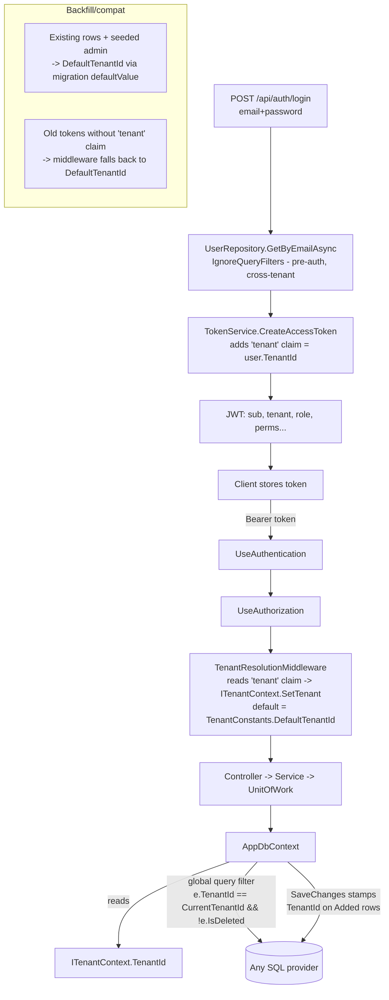

# F‑01 (Multi‑Tenancy) + F‑03 (Provider‑Agnostic Indexes) — Change Log

> **Status:** Stage 1 of the requirement‑fit remediation (F‑01, F‑03). F‑02 (roles→permissions + neutral vocabulary + frontend) follows in Stage 2.
> **Guardrails honored:** existing public API/ABI, DTO JSON shape, routes, and the frontend contract are **unchanged**. Tenancy is derived server‑side from the JWT with a default "root" tenant, so already‑issued tokens and existing data keep working.
> **Provider‑agnostic:** no raw provider SQL is introduced; all indexing/filtering uses EF Core LINQ/SDK APIs that translate to any provider (SQLite, PostgreSQL, SQL Server, Oracle, MySQL, …).

---

## 1. Mind map — how tenancy flows end‑to‑end (Rule 5)

**Key isolation invariant:** every read/write through `AppDbContext` for a `BaseEntity` is automatically constrained to `CurrentTenantId`. The only intentional cross‑tenant reads are the **pre‑authentication** user lookups (login/refresh), which use `IgnoreQueryFilters()` and then pin the tenant from the resolved user into the JWT.

---

## 2. Game plan (Rule 2)

**Plan A (chosen):** ambient tenant resolved from a `tenant` JWT claim into a scoped `ITenantContext`; a single global query filter (`TenantId == CurrentTenantId && !IsDeleted`) applied to every `BaseEntity` centrally in `AppDbContext`; `TenantId` stamped on insert; a well‑known default "root" tenant for existing data and legacy tokens.

**Fallback / Plan B (documented, not needed now):** if instance‑member query filters ever conflict with model caching on a future provider, fall back to explicit `.Where(e => e.TenantId == _tenant.TenantId)` in a tenant‑aware base repository, plus a DB session variable (e.g. PostgreSQL RLS `SET app.tenant`) for defence in depth.

**F‑03 Plan C (chosen):** delete the two SQL‑Server‑specific filtered unique indexes (`HasFilter("[Barcode] IS NOT NULL AND [IsDeleted] = 0")`) and replace them with provider‑agnostic composite `HasIndex(TenantId, Barcode)` / `HasIndex(TenantId, SerialNumber)` lookups; uniqueness‑when‑present is enforced per‑tenant in the application layer via LINQ (already tenant + soft‑delete scoped by the global filter). No raw SQL remains in the mapping layer.

---

## 3. Files changed / added

### 3.1 New files (added)

| File | Purpose / benefit |
|------|-------------------|
| [server/InventoryManagement.Domain/Constants/TenantConstants.cs](server/InventoryManagement.Domain/Constants/TenantConstants.cs) | `DefaultTenantId` (`…0001`) — the well-known "root" tenant used to backfill existing rows and to serve legacy tokens. Enables backward compatibility. |
| [server/InventoryManagement.Domain/Common/ITenantContext.cs](server/InventoryManagement.Domain/Common/ITenantContext.cs) | Ambient, request-scoped tenant abstraction (`TenantId`, `IsResolved`, `SetTenant`). Lives in Domain so it stays framework-agnostic and reusable. |
| [server/InventoryManagement.Infrastructure/Multitenancy/TenantContext.cs](server/InventoryManagement.Infrastructure/Multitenancy/TenantContext.cs) | Scoped `ITenantContext` implementation; defaults to `DefaultTenantId` until resolved (keeps seed/design-time/background contexts working). |
| [server/InventoryManagement.API/Infrastructure/TenantResolutionMiddleware.cs](server/InventoryManagement.API/Infrastructure/TenantResolutionMiddleware.cs) | Reads the `tenant` JWT claim → pins `ITenantContext`; falls back to `DefaultTenantId`. Registered after authentication. |
| [server/InventoryManagement.Infrastructure/Migrations/20260822115724_AddMultiTenancy.cs](server/InventoryManagement.Infrastructure/Migrations/20260822115724_AddMultiTenancy.cs) | Adds `TenantId` to 7 tables (backfilled to `…0001`), adds tenant/composite indexes, and **drops the 4 provider-specific filtered unique indexes** + swaps `decimal(18,2)` column types for precision metadata. |

### 3.2 Modified files (F‑01 multi‑tenancy)

- [BaseEntity.cs](server/InventoryManagement.Domain/Common/BaseEntity.cs) — **added** `Guid TenantId`. Every persisted row now carries its owning tenant.
- [AppDbContext.cs](server/InventoryManagement.Infrastructure/Data/AppDbContext.cs) — **added** optional `ITenantContext` ctor param + `CurrentTenantId`; **centralized** a single `TenantId == CurrentTenantId && !IsDeleted` global query filter for every `BaseEntity` (generic reflection helper, evaluated as a per-request parameter); **stamps** `TenantId` on insert. **Removed** the need for per-config filters.
- [AuthConstants.cs](server/InventoryManagement.Domain/Constants/AuthConstants.cs) — **added** `Claims.Tenant = "tenant"`.
- [TokenService.cs](server/InventoryManagement.Infrastructure/Security/TokenService.cs) — **added** the `tenant` claim to issued access tokens.
- [UserDto.cs](server/InventoryManagement.Domain/DTOs/UserDto.cs) + [MappingExtensions.cs](server/InventoryManagement.Application/Mapping/MappingExtensions.cs) — **added** `TenantId` (additive JSON field; the frontend ignores unknown fields, so the client is unaffected).
- [UserRepository.cs](server/InventoryManagement.Infrastructure/Repositories/UserRepository.cs) — `GetByEmailAsync`, `IsEmailExistsAsync`, `GetByActiveRefreshTokenHashAsync` now use `IgnoreQueryFilters()` (pre-auth, cross-tenant) with explicit `!IsDeleted`. Email is the global login key.
- [Infrastructure/Extensions/ServiceCollectionExtensions.cs](server/InventoryManagement.Infrastructure/Extensions/ServiceCollectionExtensions.cs) — **registered** `ITenantContext`→`TenantContext` (scoped); seed admin existence check made cross-tenant.
- [Program.cs](server/InventoryManagement.API/Program.cs) — **registered** `TenantResolutionMiddleware` after `UseAuthorization`.

### 3.3 Modified files (F‑03 provider‑agnostic mapping)

Removed **all** raw provider SQL from the model configuration; replaced with EF Core LINQ/SDK APIs that translate to any provider:

| File | Removed (provider-specific) | Replaced with (provider-agnostic) |
|------|-----------------------------|-----------------------------------|
| [InventoryConfiguration.cs](server/InventoryManagement.Infrastructure/Data/Configurations/InventoryConfiguration.cs) | `HasFilter("[Barcode] IS NOT NULL AND [IsDeleted] = 0")`, same for `SerialNumber`; `HasColumnType("decimal(18,2)")` | `HasIndex(TenantId, Barcode)` / `HasIndex(TenantId, SerialNumber)` composites; `HasPrecision(18, 2)` |
| [LocationConfiguration.cs](server/InventoryManagement.Infrastructure/Data/Configurations/LocationConfiguration.cs) | `HasFilter("[Code] IS NOT NULL AND [IsDeleted] = 0")` | `HasIndex(TenantId, Code)` composite |
| [SupplierConfiguration.cs](server/InventoryManagement.Infrastructure/Data/Configurations/SupplierConfiguration.cs) | `HasFilter("[IsDeleted] = 0")` on unique Name | `HasIndex(TenantId, Name)` composite |
| [StockMovementConfiguration.cs](server/InventoryManagement.Infrastructure/Data/Configurations/StockMovementConfiguration.cs) | `HasColumnType("decimal(18,2)")` | `HasPrecision(18, 2)` |
| All 7 `*Configuration.cs` | per-config `HasQueryFilter(x => !x.IsDeleted)` | centralized in `AppDbContext`; added `IX_*_TenantId` indexes |

**Uniqueness preserved:** barcode/serial/code/name uniqueness "when present" was already enforced per record in the application layer (`InventoryService`, `LocationService.IsCodeExistsAsync`, `SupplierService.IsNameExistsAsync`); those checks are now **automatically tenant-scoped** by the global filter, so uniqueness became per-tenant with no extra code.

> **Residual (documented, out of scope for this stage):** without a DB-level unique constraint, the pre-existing check-then-act race (audit **F‑12**) can still let two simultaneous inserts create a duplicate. Mitigation (catch unique-violation → 409, or a distributed lock) is tracked separately.

### 3.4 Verification (Rule 3)

- `dotnet build` (API + all referenced projects): **succeeded**.
- `dotnet test` (whole solution): **53/53 passed** (Domain 11, API 3, Infrastructure 21, Application 18) — including the real-SQLite `InventoryRepositoryTests` and `ConcurrencyTests` that exercise the new global filter + stamping.
- **Runtime smoke test** against a fresh SQLite DB: `AddMultiTenancy` migration applied on startup; admin seeded; `POST /api/auth/login` → JWT `tenant` claim = `…0001` and `user.tenantId` = `…0001`; `GET /api/inventory` (tenant-filtered) → 200; `POST /api/inventory` → 201 then list returns the row (stamp-on-insert + filter-on-read round trip confirmed).

### 3.5 Frontend impact

**None for this stage.** No route, DTO field, or enum changed shape; the only addition is an extra `tenantId` field in user JSON, which existing TypeScript interfaces ignore at runtime. The client continues to work unchanged. (Frontend changes land in Stage 2 with F‑02's field rename + roles→permissions.)

---

## 4. Stage 2 preview — F‑02 (next change)

Replace `IsAdmin`/`IsProvider`/`UserRole` with per-tenant **Roles + Permissions + RolePermissions + UserRoleAssignments** (dynamic, client-managed), emit permission claims in the JWT, add a permission-based authorization policy provider, rename `equipmentName`→`name`, and update the frontend (`types.ts`, `auth-context`, route guards, user/role UI) in lockstep. Tracked separately so this tenancy/provider-agnostic stage lands cleanly on its own.
